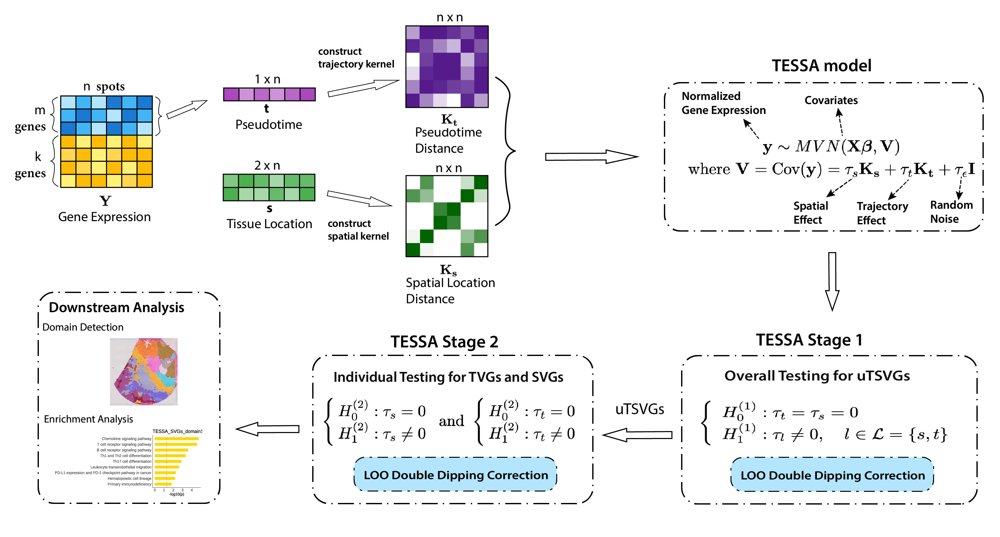

# TESSA: A unified model to detect trajectory-preserved and spatially-variable genes in spatial transcriptomics



## Installation
To install the latest version of the TESSA package from GitHub, run the following code in R:
<!-- test how to install when we are public repo? -->
```
install.packages('devtools')
library(devtools)
devtools::install_github('Cui-STT-Lab/TESSA')
```
This command should automatically install all required packages if they are not installed already.

## Quick Start
<!-- See [Tutorial](https://lulushang.org/Celina_Tutorial/index.html) for detailed documentation and examples. -->


<!-- build_kernelMatrix <- function(object, bw = NULL){
  ## bandwidth selection
  counts <- object@gene_expression
  bw_vector <- apply(counts, MARGIN = 1, stats::bw.nrd)
  object@bandwidth <- mean(na.omit(bw_vector))
  ## construct kernel matrix for each lineage
  t_vars <- str_subset( colnames(object@meta_df),'lineage')
  for(t_var in t_vars ){
    object <- build_kernelMatrix_lineage(object, lineage = t_var, bw = object@bandwidth )
  }
  object
} -->